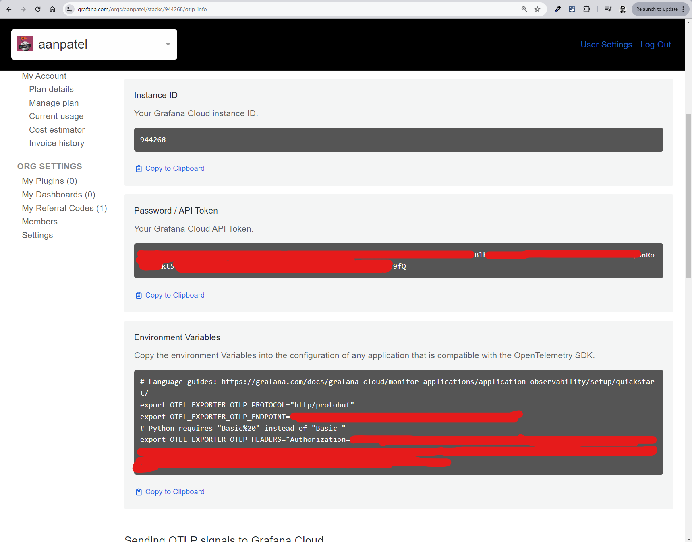

# Instructions for Step 3

In this step, we will add some opinionated observability instrumentation to our LLM application using OpenLLMetry. This will send metrics and traces to an OpenTelemetry http backend.

## 1. Grafana Cloud Setup

For this example project, we have utilized Grafana Cloud, which is free and easy to set up. You can quickly sign up for a free account at https://grafana.com/auth/sign-up/create-user (supports social sign-up including Google).

Once you have signed into Grafana Cloud, open the "Stacks" link to visit the configuration portal. There are multiple ways to configure observability for your apps with Grafana, and this portal lets you configure them. However, we are focusing on OpenTelemetry for this example.


## 2. OpenTelemetry Configuration

We will be leveraging Grafana's http OpenTelemetry backend for traces for this example. OpenLLMetry package accepts an API token and a base URL for the OpenTelemetry backend.

Scroll down to find OpenTelemetry among the options and click on "Configure". This will take you to the OpenTelemetry configuration page.


Here, you will find that the base URL for the OpenTelemetry backend is already provided. You will need to generate an API token to send traces to this backend.


Click on "Generate now" to generate a fresh API token and provide an apt name for it when prompted (usually the name of the project or app you will use the token with).


Copy the API token and other related environment variables to a .env file. Grafana makes this easy for you by providing a "Copy to clipboard" button for the environment variables.



```bash
OTLP_EXPORT_PROTOCOL="http/protobuf"
OTLP_ENDPOINT="https://otlp-gateway-prod-us-east-0.grafana.net/otlp"
OTLP_AUTHORIZATION_HEADER="" # copy from the generated environment variables. For Grafana, "Basic <base64-encoded-token>" is verified to work.
OPENAI_API_KEY="" # get your OpenAI API key from https://platform.openai.com/account/api-keys
```

## 3. Instrument the LLM Application

As part of API setup, simply make a method call, and Traceloop SDK will handle the rest!

```python
import os
from traceloop.sdk import TraceLoop
from opentelemetry.instrumentation.openai import OpenAIInstrumentor
Traceloop.init("arithmetic_service",api_endpoint=os.getenv("OTLP_ENDPOINT"), headers={"Authorization": os.getenv("OTLP_AUTHORIZATION_HEADER")})
OpenAIInstrumentor().instrument()
```

Now, you can run the app, try out the endpoint, and see the traces and metrics in Grafana Cloud!

